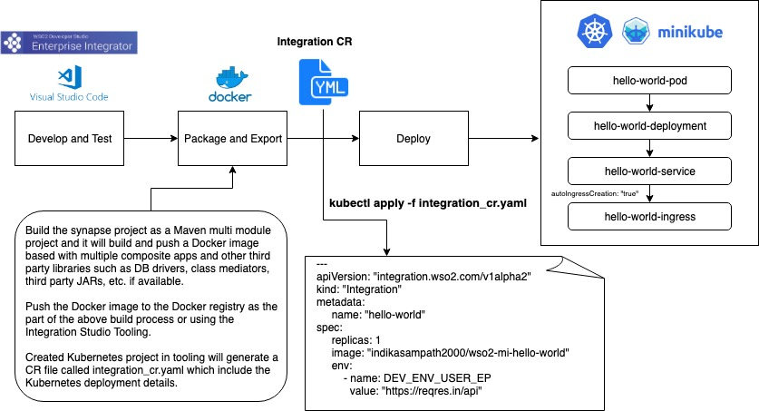

# k8s-ei-operator - Native support for Kubernetes Ecosystem with WSO2 Micro Integrator
The k8s-ei-operator allows you to deploy your integration into Kuberntes environment build on top of 
WSO2 Enterprise Integrator Tooling.

## Defining an “Integration” 
An integration is self-contained and independently deployable integration scenario composed with an arbitrary 
set of EI constructs which directly maps to a business capability.

An integration scenario could divide into the following three categories. 
* Synchronous service which may communicate with other systems
* Asynchronous  message Consumer/Producer  
* A periodically invoked pre-defined integration (e.g. Tasks)

## Getting started
The k8s-ei-operator built with operator-sdk v0.7.0 and supported in the following environment.
* Kubernetes cluster and client v1.11+

## Install k8s-ei-operator

1. Create the folder structure `$GOPATH/src/github.com/wso2` if not available and clone k8s-ei-operator git repo:
    ```
    git clone https://github.com/wso2/k8s-ei-operator.git
    ```
2. Change directory to k8s-ei-operator:
    ```
    cd $GOPATH/src/github.com/wso2/wso2/k8s-ei-operator
    ```
3. Setup Service Account:
    ```
    kubectl create -f deploy/service_account.yaml
    ```
4. Setup RBAC:
    ```
    kubectl create -f deploy/role.yaml
    kubectl create -f deploy/role_binding.yaml
    ```
5. Deploy integration CustomResourceDefinition into Kubernetes cluster to understand custom resource type:
    ```
    kubectl create -f deploy/crds/integration_v1alpha1_integration_crd.yaml
    ```
6. Deploy the k8s-ei-operator:
    ```
    kubectl create -f deploy/operator.yaml
    ```
7. Apply configuration for the ingress controller:
    ```
    kubectl apply -f deploy/config_map.yaml
    ```
8. Add the host `wso2ei` and related external IP (ADDRESS) to the `/etc/hosts` file in your machine.
   (For Minikube, you have to use Minikube IP as the external IP. Hence, run `minikube ip` command to get the IP of the Minikube cluster)        

## Deploy the integration solutions using the EI Operator
Deploy a sample integration to start WSO2 Micro Integrator runtime which having 'User Info' API
```
kubectl apply -f deploy/crds/user_mgt_demo_integration.yaml
```
List the deployed integration:
```
kubectl get integration
```

## Run the integration solution

Invoke the 'User Info' API once the STATUS changes to **Running** 

### With **Ingress Controller**
i. HTTP Request
```
curl http://wso2ei/user-mgt-demo-integration-service/userInfo/users
```
ii. HTTPS Request
```
curl https://wso2ei/user-mgt-demo-integration-service/userInfo/users -k
```

### Without **Ingress Controller**
i. Port forward
```
kubectl port-forward service/user-mgt-demo-integration-service 8290:8290
```
ii. Invoke the API
```
curl http://localhost:8290/userInfo/users
```

## Developer Workflow

