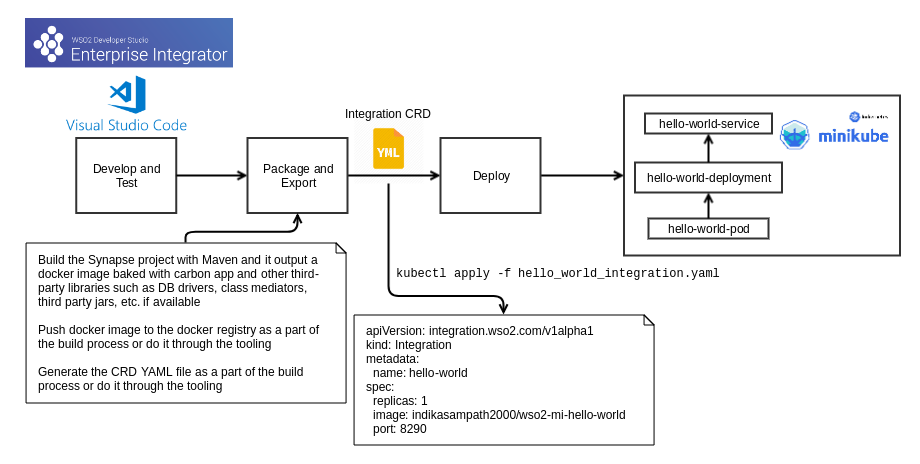

# k8s-ei-operator - Native support for Kubernetes Ecosystem with WSO2 Micro Integrator
The k8s-ei-operator allows you to deploy your integration into Kuberntes environment build on top of 
WSO2 Enterprise Integrator Tooling.

## Defining an “Integration” 
An integration is self-contained and independently deployable integration scenario composed with an arbitrary 
set of EI constructs which directly maps to a business capability.

An integration scenario could divide into the following three categories. 
* Synchronous service which may communicate with other systems
* Asynchronous  message Consumer/Producer  
* A periodically invoked pre-defined integration (e.g. Tasks)

## Getting started
The k8s-ei-operator built with operator-sdk v0.7.0 and supported in the following environment.
* Kubernetes cluster and client v1.11+

## Install k8s-ei-operator

### Standard mode
1. Create the folder structure `$GOPATH/src/github.com/wso2` if not available and clone k8s-ei-operator git repo
    ```
    git clone https://github.com/wso2/k8s-ei-operator.git
    ```
2. Change directory to k8s-ei-operator
    ```
    cd $GOPATH/src/github.com/wso2/wso2/k8s-ei-operator
    ```
3. Setup Service Account
    ```
    kubectl create -f deploy/service_account.yaml
    ```
4. Setup RBAC
    ```
    kubectl create -f deploy/role.yaml
    kubectl create -f deploy/role_binding.yaml
    ```
5. Deploy integration CustomResourceDefinition into Kubernetes cluster to understand custom resource type
    ```
    kubectl create -f deploy/crds/integration_v1alpha1_integration_crd.yaml
    ```
6. Deploy the k8s-ei-operator
    ```
    kubectl create -f deploy/operator.yaml
    ```
7. Deploy sample integration to start WSO2 micro integrator runtime which having 'Hello World' proxy service
    ```
    kubectl apply -f deploy/crds/hello_world_integration.yaml
    ```
8. List the deployed integration
    ```
    kubectl get integration
    ```
9. Invoke the Hello World service once STATUS becomes **Running**
    i. Port forward
    ```
    kubectl port-forward service/hello-world-service 8290:8290
    ```
    ii. Invoke the API
    ```
    curl http://localhost:8290/services/HelloWorld
    ```
 
### Development mode
1. Check out and install the [operator-sdk CLI](https://github.com/operator-framework/operator-sdk#quick-start)
2. Install [minikube](https://github.com/kubernetes/minikube#installation) and start Kubernetes cluster
3. Create the folder structure `$GOPATH/src/github.com/wso2` if not available and clone k8s-ei-operator git repo
	```
	git clone https://github.com/wso2/k8s-ei-operator.git
	```
4. Change directory to k8s-ei-operator
	```
	cd $GOPATH/src/github.com/wso2/wso2/k8s-ei-operator
	```
5. Deploy integration CustomResourceDefinition into Kubernetes cluster to understand custom resource type
	```
	kubectl create -f deploy/crds/integration_v1alpha1_integration_crd.yaml
	```
6. Run the operator code as a Go program outside the Kubernetes cluster
	```
	operator-sdk up local
	```
7. Deploy sample integration to start WSO2 micro integrator runtime which having 'Hello World' proxy service
	```
	kubectl apply -f deploy/crds/hello_world_integration.yaml
	```
8. List the deployed integration
	```
	kubectl get integration
	```
9. Invoke the Hello World service once STATUS becomes **Running**

	i. Port forward
	```
	kubectl port-forward service/hello-world-service 8290:8290
	```
	ii. Invoke the API
	```
	curl http://localhost:8290/services/HelloWorld
	```

## Developer Workflow

